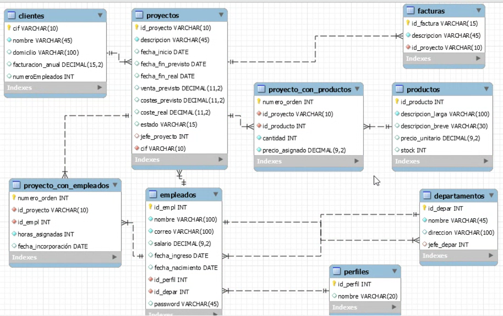

# AI-3. Proyecto

## Contexto del Proyecto

Una empresa se dedica a ejecutar proyectos encargados por sus clientes. Y registra la información de los empleados que participan en ellos, de los productos que usa para sus proyectos, y de las facturas emitidas al cliente.

La aplicación la van a usar los siguientes perfiles, dados de alta en el sistema:

1. Control de Gestión.
2. Jefe de Proyecto
3. Operativo
4. Recursos Humanos

Modelo de datos completo

Prepara datos de prueba suficientes para poder arrancar la aplicación.

Las clases correspondientes a este modelo de datos te lo proporcionamos a través de la plataforma en un zip para que todos tengamos la misma información: de cada clase te proporcionamos: los datos privados, el constructor por defecto, y los getter an setter. Tu lo debes completar con los constructores que quieras, el equals y hashcode, y los toString.

El diseño de las páginas, te lo dejo a tu elección, pero recuerda que primero se hace el proyecto operativo y si te sobra tiempo lo adornas.

## Desarrollo del proyecto

### Entrada a la aplicación

Se ha diseñado una página de login común, en donde se logan con su número de empleado, su correo electrónico y su password, y dependiendo del rol que representan se le muestra su página de inicio. Hay que tener presente que cada usuario solo puede tener asignado un perfil.

No hay opción de registrarse, las altas de empleado son llevadas a cabo por Recursos Humanos.

Las altas de Cliente, Proyecto y Producto, son llevadas a cabo por Control de Gestión

### Perfil Control de gestión

@RequestMapping(“/gestión”)

Url’s a desarrollar **obligatorias** para la actividad.

- “/altaProyecto”: el código de proyecto lo asigna control de gestión. Al proyecto se le asigna un cliente existente y un jefe de proyecto, que siempre será un empleado con perfil “Jefe de Proyecto”. Elestado activo y los datos de previsto.
- “/terminarProyecto”: se le asigna los parámetros de coste real(dato inventado), fecha fin real, estado “terminado”.

Url’s a desarrollar opcionales para la actividad.

- “/altaProducto”: formulario para dar de alta un nuevo producto

### Perfil jefe de Proyecto

@RequestMapping(“/jefe”)

Url’s a desarrollar obligatorias para la actividad.

- **“/proyectos”**: nada más logarse le sacamos en su pantalla un jsp, con la lista de proyectos activos de la que el es jefe de proyecto, con las opciones :
  - Ver Detalle, asignar empleados
- **“/ver Detalle/{id}”**: una página jsp con cada dato del proyecto, el nombre del cliente y el listado de los empleados asignados a ese proyecto, y los productos asignados a ese proyecto.

## A partir de aquí todo es opcional y puedes dar rienda suelta a tu imaginación

- “/asignarEmpleados”
  - Sacar la lista de empleados en un jsp y asignar los empleados necesarios con las horas que van a dedicar a ese proyecto y la fecha prevista de incorporación y una opción que sea:
    - “/desasignar/{id}
  - **“/desasignar/{id}”** : el empleado no se puede incorporar al proyecto y lo borramos de este proyecto.
  - “asignarProductos”: mostrar por página JSP la lista de productos de la base de datos y asignar al proyecto los productos seleccionados, con la cantidad necesaria y el precio asignado(que por defecto será el precio del producto.
  - ...

### @RequestMapping(“/empleados”)

### @RequestMapping(“/RRHH”)
